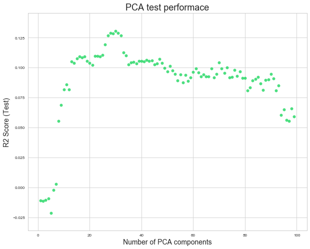

## Contents
{:.no_toc}
*  
{: toc}

## Source Code

Please refer to [Baseline Models](https://github.com/toledy/spotify/blob/master/notebooks/baseline_models.ipynb) for the source code (Jupyter Notebook).

## Baseline Models 

In this section, our goal is to examine the baseline performance of simple regression models on the test set. We would use these baseline test set $R^2$ score as a reference for building more complex models. The models included in this section are mostly multi-linear regression models with different subset of predictors and possible polynomial/interaction terms. PCA and Lasso/Ridge are explored here as well. 

We choose to start with linear regression because of its high interpretability and low computational compexity. We can easily interpret the results of regression coeffcients by holding all other predictors constant and observing how a one unit increase in the specified predictor leads to a change in units indicated by the coefficent in the response variables. Linear regression also has a closed form solution for coefficients which reduces computational complexity and promotes efficiency.

Linear regression has the following assumptions: 
* There is a linear relationship between response variables and predictors
* Residuals are independent
* Residuals are normally distributed
* Residuals has constant variance 

To evaluate baseline models, we use the metric $R^2$, which is the proportion of overall variability of $Y$ explained by the model. We do note that $R^2$ has the tendency to overfit as it will always go up for the training set when we include more predictors.

### Multi-Linear Regression Model with All Predictors

As the first step, we fit a multi-linear regression with all predictors that we have. This model would not neccessarily perform well because of the sheer number of predictors (949 in total). However, we want to conduct a sanity check through this model to make sure that prediction power is reasonable.

The test $R^2$ score for multi-linear regression model with all predictors is -2.7797. Our prediction does a worse predcition job than the mean of response varaibles. This is evidence suggesting that we are overfitting our model with too many predictors. Therefore, going forward, we would like to fit a regression model with a subset of predictors in this model.

    For Multi-Linear Regression with All Terms:
    R2 Score (Training) = 0.7656
    R2 Score (Test) = -2.7797

<iframe id="igraph" scrolling="no" style="border:none;" seamless="seamless" src="https://plot.ly/~tingnoble/7.embed" height="525px" width="100%"></iframe>

###  Multi-Linear Regression Model with Top Artists Predictors

In our prelimnary EDA anlaysis, we believe that top artists would be a good predictor for the success of a playlist. Therefore, here, we fit a model that only includes predictors related to artists. Specifically, we use the one-hot encoded variables of the top 30 artists as predictors. As a note, top artist are those who appear most often in playlists with 350,000+ followers. With more than 350,000 followers, a playlist will beat 80% of playlists in terms of followers. 

Our regression generates a test $R^2$ score of 0.0174, which is much better than -2.7797 when using all predictors. Therefore, there is good reason to consider these predictors in future model estimation.

From the regression summary table, we obtain the list of significant top 30 artist predictors:
* 'Galantis', 'Post Malone', 'Yo Gotti', 'Ellie Goulding'

    For Multi-Linear Regression with Top 30 Artist Predictors:
    R2 Score (Training) = 0.0617
    R2 Score (Test) = 0.0174

<iframe id="igraph" scrolling="no" style="border:none;" seamless="seamless" src="https://plot.ly/~tingnoble/9.embed" height="525px" width="100%"></iframe>

###  Multi-Linear Regression Model with Top Artists Counts Predictors

Next, we continue to evaluate artist predictors. Here, top artists are defined differently from above. Specifically, we first sum up the total number of followers for playlists that include an artist. Then, we rank the artists based on the aggregated playlist followers. The predictors are then the number of top 10/10-20/20-30/30-40/40-50 artists that a playlist has.

From the regression result, we observe that $R^2$ training result is 0.0126 and the test result is -0.0312. The significant predictors includes only "top_30_40". It seems that the $R^2$ test score are lower than when using the one-hot encoded artist columns instead. This highlights the potential preference to use one-hot encoded artist variables going forward.

    For Multi-Linear Regression with Top Artist Count Predictors:
    R2 Score (Training) = 0.0126
    R2 Score (Test) = -0.0312

<table class="simpletable">
<caption>OLS Regression Results</caption>
<tr>
  <th>Dep. Variable:</th>        <td>Followers</td>    <th>  R-squared:         </th> <td>   0.013</td>
</tr>
<tr>
  <th>Model:</th>                   <td>OLS</td>       <th>  Adj. R-squared:    </th> <td>   0.009</td>
</tr>
<tr>
  <th>Method:</th>             <td>Least Squares</td>  <th>  F-statistic:       </th> <td>   3.204</td>
</tr>
<tr>
  <th>Date:</th>             <td>Thu, 07 Dec 2017</td> <th>  Prob (F-statistic):</th>  <td>0.00702</td>
</tr>
<tr>
  <th>Time:</th>                 <td>14:37:36</td>     <th>  Log-Likelihood:    </th> <td> -3166.5</td>
</tr>
<tr>
  <th>No. Observations:</th>      <td>  1257</td>      <th>  AIC:               </th> <td>   6345.</td>
</tr>
<tr>
  <th>Df Residuals:</th>          <td>  1251</td>      <th>  BIC:               </th> <td>   6376.</td>
</tr>
<tr>
  <th>Df Model:</th>              <td>     5</td>      <th>                     </th>     <td> </td>   
</tr>
<tr>
  <th>Covariance Type:</th>      <td>nonrobust</td>    <th>                     </th>     <td> </td>   
</tr>
</table>
<table class="simpletable">
<tr>
      <td></td>         <th>coef</th>     <th>std err</th>      <th>t</th>      <th>P>|t|</th>  <th>[0.025</th>    <th>0.975]</th>  
</tr>
<tr>
  <th>const</th>     <td>    9.6438</td> <td>    0.097</td> <td>   99.900</td> <td> 0.000</td> <td>    9.454</td> <td>    9.833</td>
</tr>
<tr>
  <th>top_0_10</th>  <td>    0.1075</td> <td>    0.274</td> <td>    0.392</td> <td> 0.695</td> <td>   -0.431</td> <td>    0.646</td>
</tr>
<tr>
  <th>top_10_20</th> <td>    0.2819</td> <td>    0.358</td> <td>    0.788</td> <td> 0.431</td> <td>   -0.420</td> <td>    0.984</td>
</tr>
<tr>
  <th>top_20_30</th> <td>   -0.1965</td> <td>    0.280</td> <td>   -0.702</td> <td> 0.483</td> <td>   -0.745</td> <td>    0.352</td>
</tr>
<tr>
  <th>top_30_40</th> <td>    0.7624</td> <td>    0.273</td> <td>    2.789</td> <td> 0.005</td> <td>    0.226</td> <td>    1.299</td>
</tr>
<tr>
  <th>top_40_50</th> <td>    0.7486</td> <td>    0.321</td> <td>    2.330</td> <td> 0.020</td> <td>    0.118</td> <td>    1.379</td>
</tr>
</table>
<table class="simpletable">
<tr>
  <th>Omnibus:</th>       <td>79.718</td> <th>  Durbin-Watson:     </th> <td>   1.945</td>
</tr>
<tr>
  <th>Prob(Omnibus):</th> <td> 0.000</td> <th>  Jarque-Bera (JB):  </th> <td>  83.686</td>
</tr>
<tr>
  <th>Skew:</th>          <td>-0.595</td> <th>  Prob(JB):          </th> <td>6.73e-19</td>
</tr>
<tr>
  <th>Kurtosis:</th>      <td> 2.574</td> <th>  Cond. No.          </th> <td>    4.32</td>
</tr>
</table>

###  Multi-Linear Regression Model with Genre Predictors

In our prelimnary EDA anlaysis, we also believe that genres would be a good predictor for playlist followers. Therefore, we fit a regression model with only genre predictors. Here，each predictors is a categorical variable indicating whether the playlist belongs to a specified genre.

When we use all of the genre predictors, we see that training $R^2$ score is 0.5975 and test $R^2$ score is -3.7847. This again is the result of overfitting since we have 865 genre columns. Therefore, we fit another regression model with only significant genre predictors from the full genre regression model. This time, we have a training $R^2$ score of 0.0923 and test $R^2$ score of 0.0071. The number of significant genre predictors is 54.

Therefore, a subset of genre predictors could still be important and should be considered for building future models.

    For Multi-Linear Regression with All Genre Predictors:
    R2 Score (Training) = 0.5975
    R2 Score (Test) = -3.7847
    Number of Genre Predictors = 865

<iframe id="igraph" scrolling="no" style="border:none;" seamless="seamless" src="https://plot.ly/~tingnoble/11.embed" height="525px" width="100%"></iframe>

    For Multi-Linear Regression with Significant Genre Predictors:
    R2 Score (Training) = 0.0923
    R2 Score (Test) = 0.0071
    Number of Genre Predictors = 54

### Multi-Linear Regression with Solely Significant Predictors

Initially, our model included all predictors and thus tends towards overfitting. Here, we fit a model with solely significant predictors (out of all predictors) in the aim to reduce overfitting. We have a total of 49 predictors (cut down from 949 originally).

Test $R^2$ score goes up to 0.0826, which is the best $R^2$ score we have achieved so far. This indicates that our previous model indeed suffers from overfitting.

    For Multi-Linear Regression with Solely Significant Predictors:
    R2 Score (Training) = 0.2229
    R2 Score (Test) = 0.0826

### Bootstrapping for 10% Predictors

From previous parts, we observe that a smaller subset of original predictors may perform better in terms of test set prediction. Therefore, below, we randomly choose 10% of predictors and fit a regression model. We do 500 iterations and record the corresponding $R^2$ test score and the associated predictors.

We achieve a $R^2$ test score of 0.2246. However, since predictors are being randomly chosen, this result could come from chance alone and may not be very robust.

    After Bootstrapping for 10% of predictors, Best R2 Score (Test) = 0.2246
    The Associated Predictors are :['acousticness_std', 'dance_mean', 'key_std', 'mode_mean', 'valence_mean', 'popularity_mean', 'popularity_std', 'top_30_40', " 'alternative roots rock'", " 'art rock'", " 'austindie'", " 'boston rock'", " 'canadian pop'", " 'catstep'", " 'ccm'", " 'celtic rock'", " 'chillhop'", " 'classic funk rock'", " 'cool jazz'", " 'deep talent show'", " 'deep tech house'", " 'detroit techno'", " 'escape room'", " 'filmi'", " 'filter house'", " 'garage rock'", " 'german indie'", " 'glitch'", " 'indie poptimism'", " 'jazz'", " 'jump blues'", " 'memphis blues'", " 'neo soul'", " 'new romantic'", " 'noise punk'", " 'ok indie'", " 'power pop'", " 'progressive house'", " 'rockabilly'", " 'soundtrack'", " 'symphonic rock'", " 'teen pop'", " 'thrash core'", " 'urban contemporary'", " 'vegan straight edge'", " 'worship'", "'alternative americana'", "'art rock'", "'aussietronica'", "'baroque'", "'bay area indie'", "'bluegrass'", "'brass band'", "'britpop'", "'bubblegum dance'", "'chamber pop'", "'compositional ambient'", "'contemporary jazz'", "'dance pop'", "'deep big room'", "'deep contemporary country'", "'deep euro house'", "'deep swedish indie pop'", "'djent'", "'freak folk'", "'halloween'", "'indie garage rock'", "'indie pop'", "'indie poptimism'", "'japanese city pop'", "'lift kit'", "'lowercase'", "'melodic metalcore'", "'post-teen pop'", "'uk drill'", "'underground hip hop'", "'vancouver indie'", "'vapor soul'", 'Yo Gotti', 'Chance The Rapper', 'Str_2000s', 'Str_1980s', 'Str_1960s']

### Principle Component Analysis

Principle Component Analysis (PCA) is another way to reduce the number of predictors. Each component is a linear combination of all 949 orginal predictors. The components are ordered in such a way so that the amount of captured observed variance descreases. Linear regression is performed on the principal components of the PCA transformation. We attempt different numbers of PCA components from 1 to 100 and choose the optimal number of PCA components according to test $R^2$ score. 

We achieve the best $R^2$ test score of 0.1307 with 30 PCA components. Although we gain a higher test $R^2$ score and also have less predictors, we lose interpretability. We cannot pinpoint how a change in one predictor will change the response varibable because each component is a linear combination of all original columns.

    After PCA, Best R2 Score (Test) = 0.1307
    The Optimal Number of Components = 30

### Lasso and Ridge

Lasso and Ridge regularizations are also methods to penalize overly complex models. To penalize coefficients that have large magnitudes, Lasso and ridge include the magnitude of the coefficients in the loss functions. Specifically, Lasso minimizes the following function:

$$\sum_{i=1}^n (Y_i-\sum_{j=1}^p X_{ij}\beta_j)^2 + \lambda \sum_{j=1}^p |\beta_j|$$

Ridge minimizes the following function:

$$\sum_{i=1}^n (Y_i-\sum_{j=1}^p X_{ij}\beta_j)^2 + \lambda \sum_{j=1}^p (\beta_j)^2$$

We fit Ridge and Lasso with cross validation and with lambda ranging from 1e^-5 to 10^5.

Lasso Regularization:

    LassoCV(alphas=[1e-05, 0.0001, 0.001, 0.01, 0.1, 1, 10, 100, 1000, 10000],
        copy_X=True, cv=None, eps=0.001, fit_intercept=True, max_iter=1000,
        n_alphas=100, n_jobs=1, normalize=False, positive=False,
        precompute='auto', random_state=None, selection='cyclic', tol=0.0001,
        verbose=False)

Ridge Regularization:

    RidgeCV(alphas=[1e-05, 0.0001, 0.001, 0.01, 0.1, 1, 10, 100, 1000, 10000],
        cv=10, fit_intercept=True, gcv_mode=None, normalize=True, scoring=None,
        store_cv_values=False)

    With Lasso Regularization, R2 Score (Test) = 0.1094
    With Ridge Regularization, R2 Score (Test) = 0.0959

## Summary of Baseline Models

Since we have 949 predictors in our original data, we encounter the problem of overfitting when constructing regression models. Therefore, for baseline models, we focus on selecting a subgroup of predictors that perform well in terms of $R^2$ test score. By using only the significant predictors from the full model, test $R^2$ score improves significantly (from -2.7 to 0.8). PCA gives us an $R^2$ score of 0.1307. Lasso gives up 0.1094 and Ridge gives us 0.0959. In addition, we should note that iteratively choosing 10% of predictors gives us the best baseline $R^2$ metric (0.2246). However, this model is not robust and tend toward overfitting since we do not methodologically choose the predictors. Still, we could use 0.2246 as a reference when evaluating our future models. In summary, the most robust and predictive baseline model is PCA with $R^2$ score of 0.1307. We may use 0.2246 as baseline $R^2$ test metric. 
