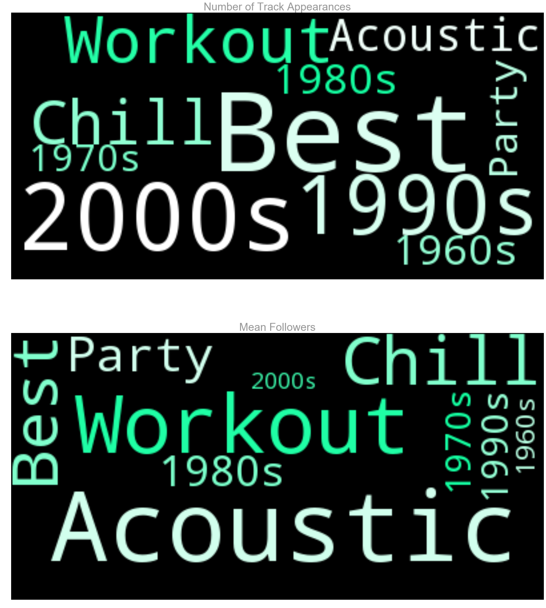

## Contents
{:.no_toc}
*  
{: toc}

After gathering and processing initial data, the next step is to conduct exploratory data anlaysis. We would like to examine which predictors include useful information. EDA will further enlighten us on the modelling process as well. 

## Source Code

Please refer to [Exploratory Data Analysis](https://github.com/toledy/spotify/blob/master/notebooks/eda.ipynb) for the source code (Jupyter Notebook).

## Predictor Variables

First, we would like to examine the dataframe for any problematic or duplicate columns. Then, we split the dataframe into training and test set. The size of the training set and test set is shown below.

    Train Size: (1278, 950)
    Test Size: (142, 950)

## Response Variable

The response variable is the number of followers for individual playlists. We note that some playlists have an extremely large number of followers, leading to a higly right skewed distribution of the response variable. To address the right skewness, a log transformation iss applied and the playlists with no followers are discarded. As can be seen by the figure below, logging the number of followers creates a relatively normal distribution. In addition, performing a log trasnformation helps with visualizing the data, modelling and making predictions. 

## Audio Features

Audio features are available on Spotify for each track. In total, eleven audio features are extracted for each track. For each playlist, the means and standard deviations of those features across the tracks in the playlist are used. 

These features are descriptors of the audio signals of each track. The full list of audio features and explanations for each are available here: 
https://developer.spotify.com/web-api/get-audio-features/

Descriptions for some important features are shown below:

**Energy:** Energy is measured on a scale from 0.0 to 1.0 and represents a perceptual measure of intensity and activity. Typically, energetic tracks are fast, loud, and noisy.

**Liveness:** Liveness refers to the presence of an audience in the recording.

**Tempo:** Tempo isthe overall estimated tempo of a track in beats per minute (BPM).

**Valence:** Valence is measured on a scale from 0.0 to 1.0 describing the musical positiveness conveyed by a track. Tracks with high valence represent postive mood (e.g. happy, cheerful, euphoric), while tracks with low valence represent more negative mood(e.g. sad, depressed, angry).

When viewed in scatterplots against the response variable, certain features seem to contain more useful information. In particular, it seems that songs with high liveness (in which we can hear an audience in the recording)and songs with high valence (positive sounding) tend to have fewer followers.

<iframe id="igraph" scrolling="no" style="border:none;" seamless="seamless" src="https://plot.ly/~tingnoble/13.embed" height="525px" width="100%"></iframe>

<iframe id="igraph" scrolling="no" style="border:none;" seamless="seamless" src="https://plot.ly/~tingnoble/15.embed" height="525px" width="100%"></iframe>

## Genre Features

Genre features describe the genres of songs in the playlist. The following bar chart shows the average number of playlist followers for the most common genres in our training data. Common genres refer to the the genres that many playlists fall under.  All of these common genres have at least 200,000 followers, which is at the high end of the spectrum. In particular, we find out that **r&b** has the highest number of mean followers.

<iframe id="igraph" scrolling="no" style="border:none;" seamless="seamless" src="https://plot.ly/~tingnoble/17.embed" height="525px" width="100%"></iframe>

The following interactive histogram allows you to view different distributions of log Followers for different genres. The button on the left is for unpopular genres, while the button on the right is for popular genres. We can see that distributions are generally all left skewed. We also see that certain genres have many tracks (counts are high), but the number of followers per track may not be high, affecting their mean followers. We see a distinction between popularity and commonality/frequency of appearance of different genres. 

<iframe id="igraph" scrolling="no" style="border:none;" seamless="seamless" src="https://plot.ly/~tingnoble/21.embed" height="525px" width="100%"></iframe>

### Interactions Between Genres and Audio Features

Interaction terms could potentially provide useful insight between genres and audio features. These could help answer questions such as: would the number of followers differ for different levels of 'danceability' for dance music vs. rap music? Because the number of genres exceed 100, the genres are first binned into broad genres such as 'house','hip hop','pop','dance','r&b','rap','acoustic','soul'. Then interaction terms are created with these broader genres. 

The following scatterplots and histograms show how audio features differ between two different genres: rap music and dance music. We observe see that their distributions differ (slightly). For example, rap music seems to be slightly higher in mean energy, and pop music seems to have a slightly higher valence. 

## Artist Features

We think that the presence of  artists who appear most often in popular playlists would be a good predictor for playlist success. To evaluate a playlist's popularity, we found out that a playlist with 35,000+ followers beat 80% of playlist in terms of followers. Therefore, we use 35,000+ as a benchmark. In the following graph, we examine the frequency of the artists appear in playlists with 35,000+playlists. We select the top 30 that appear most often as predictors. 

    array(['Yo Gotti', 'Lil Wayne', 'Axwell /\\ Ingrosso', 'Otis Redding',
           'Wiz Khalifa', 'Van Morrison', 'A$AP Rocky', '21 Savage',
           'Galantis', 'Chance The Rapper', 'Rihanna', 'JAY Z', 'Post Malone',
           'Led Zeppelin', 'Young Thug', 'Ty Dolla $ign', 'Nicki Minaj',
           'Adele', 'Deorro', 'Kanye West', 'John Mayer', 'Diddy', 'SYML',
           'Ryan Adams', 'Commodores', 'Ellie Goulding', 'Birdy', 'SZA',
           'Miguel'], dtype=object)

<iframe id="igraph" scrolling="no" style="border:none;" seamless="seamless" src="https://plot.ly/~tingnoble/25.embed" height="525px" width="100%"></iframe>

Then, we average the number of followers for all playlists that include a top 30 artist. We would like to examine whether playlists including such artists are indeed more popular. From the following graph, we can see that 80% of the time, the presense of a top 30 artist leads to an average playlist followers of over 40,0000, demonstrating that these artists are indeed potentially good predictors for playlist success.

<iframe id="igraph" scrolling="no" style="border:none;" seamless="seamless" src="https://plot.ly/~tingnoble/27.embed" height="525px" width="100%"></iframe>

## Title Features

The last categories that were explored were the titles of the playlists. Spotify users commonly search for certain words in playlist titles, such as "Best of 2017" or "Top Pop Music." Titles were parsed to find certain substrings which were common in titles, and then categorized. For example, the titles containing "top" and "best" belong to the same category (Best). Titles containing "motivation", "exercise", or "workout" were all categorized as workout song titles. The following chart shows the mean followers for these different title categories. It is clear that the "Best" category has a high number of mean followers whereas the older songs of the 20th century have a low number of mean followers. 

    Counts for Significant Titles: 
    
                  Num_tracks  Mean_Follow  Total_Follow    Std_Follow
    Str_Acoustic        21.0     855847.0    17972797.0  7.604824e+05
    Str_Workout         25.0     539889.0    13497224.0  6.673902e+05
    Str_Chill           22.0     466887.0    10271511.0  6.178177e+05
    Str_Best            78.0     432483.0    33733709.0  2.094412e+06
    Str_Party           16.0     227432.0     3638914.0  3.998216e+05
    Str_1980s           17.0     184958.0     3144285.0  4.544939e+05
    Str_1990s           41.0     134413.0     5510931.0  3.512619e+05
    Str_1970s           15.0     125646.0     1884692.0  3.223149e+05
    Str_1960s           17.0      57897.0      984241.0  1.835413e+05
    Str_2000s           56.0      33379.0     1869222.0  1.528690e+05

<iframe id="igraph" scrolling="no" style="border:none;" seamless="seamless" src="https://plot.ly/~tingnoble/29.embed" height="525px" width="100%"></iframe>

The following wordcloud visuals describe the same categories of strings. The top image represents the number of playlists in the category (frequency) and the bottom image represents the number of mean followers for playlists of the category (popularity). We observe that many playlists are from the 2000s or are for working out. Taking frequencies into account, the "party" and "best" playlists have high popularity. 

