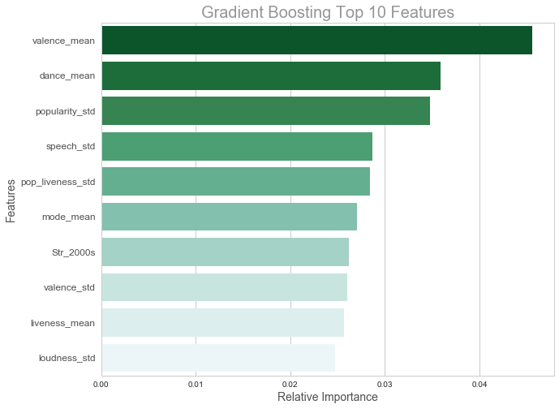
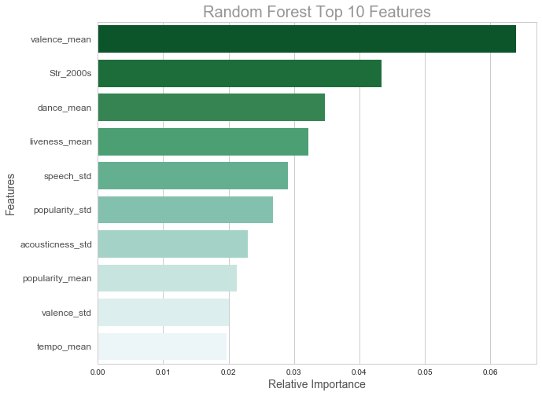
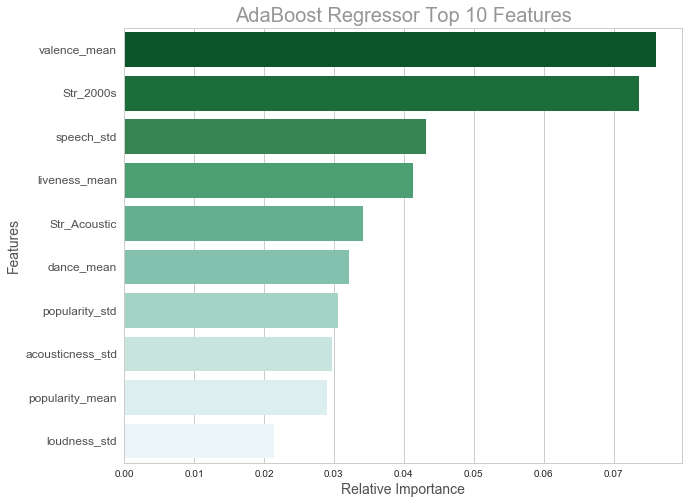

## Contents
{:.no_toc}
*  
{: toc}


## Strategy of Fitting Ensemble Models:

1) **Data Pre-Processing**: after reading the dataframe, we first split the training/test data by (90%-10% split) due to the small size of the dataset, then standardize the numerical columns before fitting the models, and finally checking for any missing data and impute accordingly. 

2) **Model Score Function**: for the simplicity of model summary, we will create a model scoring function encompassing the following 6 metrics <br/> 
- $R^2$ (R Squared)
- $EVar$ (Explained Variance Score)
- $MAE$ (Mean Absolute Error)
- $MSE$ (Mean Squared Error)
- $MSLE$ (Mean Squared Log Error)
- $MEAE$ (Median Absolute Error)

3) **Model Fitting**: here, we will fit 9 different ensemble regressors on the training data and then predict using the test data
- Gradient Boosting Regressor
- Random Forest Regressor
- Huber Regressor
- Elastic Net
- SVR
- Neural Network
- Adaboost Regressor
- Bagging Regressor
- Extra Trees Regressor

4) **Model Summary**: after fitting all the models, we will present 3 summary tables based on training score, test score and qualitative metrics for the models

5) **Cross Validation**: based on the summary, we will further fine-tune the parameters on the best model by cross validation


## Section 1. Data Pre-Processing

After reading in the dataframe, we will pre-process the data in four steps: 
- A training/test split is constructed where **90%** of the subsample is the **training** data and **10%** is the **test** data
- Locate the missing columns in the dataframe and proceed with **median-based imputation**
- After imputation, we **standardize** the numerical columns with training mean and standard deviation 
- Lastly, we **log-transform** the response variable 'No. of Followers' to make it more aligned to the Normality assumption


    Train Size: (1278, 949)
    Test Size: (142, 949)


    ['acousticness_std',
     'dance_std',
     'energy_std',
     'instrumentalness_std',
     'key_std',
     'liveness_std',
     'loudness_std',
     'mode_std',
     'speech_std',
     'tempo_std',
     'time_std',
     'valence_std',
     'followers_std',
     'popularity_std',
     'hip hop_acousticness_std',
     'pop_liveness_std',
     'dance_liveness_std',
     'r&b_acousticness_std',
     'rap_energy_std',
     'rap_key_std',
     'acoustic_acousticness_std',
     'acoustic_energy_std',
     'acoustic_key_std',
     'soul_acousticness_std']


## Section 2. Model Score Function

Here, we choose 6 metrics to evaluate our models: 

1) **$R^2$ - R Squared** = measures how well future datasets are likely to be predicted by the model. The score ranges from negative (because the model can be arbitrarily worse) to a best possible value of 1.0. Usually, the bigger the $R^2$, the better the model. Yet we do acknowledge the tedency of over-fitting with $R^2$ as with more predictors, it will only remain constant or increase.

$$R^2(y, \hat{y}) = 1 - \frac{\sum_{i=0}^{n-1}(y_i-\hat{y}_i)^2)}{\sum_{i=0}^{n-1}(y_i-\bar{y})^2}, n = \text{sample size}$$


2) **$EVar$ - Explained Variance Score** = measures how good the model explains the variance in the response variable. The score ranges from a minimum of 0 to a maximum of 1.0. Similar to $R^2$, the higher the score, the better the model.

$$EVar(y, \hat{y}) = 1 - \frac{\text{Var}(y - \hat{y})}{\text{Var}(y)}$$


3) **$MAE$ - Mean Absolute Error** = computes the expected value of the absolute error or the $l1$ loss function. For all the error functions, the smaller the error, the better the model.

$$MAE(y, \hat{y}) = \frac{1}{n} \sum_{i=0}^{n-1} |y_i-\hat{y}_i| $$


4) **$MSE$ - Mean Squared Error** = computes the expected value of the squared error

$$MSE(y, \hat{y}) = \frac{1}{n} \sum_{i=0}^{n-1} (y_i-\hat{y}_i)^2 $$


5) **$MSLE$ - Mean Squared Log Error** = computes the expected value of the squared logarithmic error. This would probably be the most appropriate metric to evalute our models as we log-transformed our response variable - number of followers for the playlist. 

$$MSLE(y, \hat{y}) = \frac{1}{n} \sum_{i=0}^{n-1} [\ln(1+y_i)-\ln(1+\hat{y}_i)]^2$$


6) **$MEAE$ - Median Absolute Error** = computes the loss function by using the median of all absolute differences between the actual values and the predicted values. This metric is robust to outliers. 

$$MEAE(y, \hat{y}) = \text{median}(|y_1-\hat{y}_1|, \cdots, |y_n-\hat{y}_n|)$$

The key metrics given the parameters of our pre-processing are 1) $R^2$ and 5) $MSLE$, which will be the most important basis of comparison for the 9 ensemble models.


```python
# Define score for regression model
def expected_score1(model, x, y):
    R2 = 0
    EVar = 0
    MAE = 0
    MSE = 0
    MSLE = 0
    MEAE = 0

    R2 += model.score(x, y)
    EVar += explained_variance_score(y, model.predict(x))
    MAE += mean_absolute_error(y, model.predict(x))
    MSE += mean_squared_error(y, model.predict(x))
    MSLE += mean_squared_log_error(y, model.predict(x))
    MEAE += median_absolute_error(y, model.predict(x))

    return pd.Series([R2 / 100., 
                      EVar / 100., 
                      MAE / 100., 
                      MSE / 100.,
                      MSLE / 100.,
                      MEAE / 100.],
                      index = ['R2', 'EVar', 'MAE', 'MSE', 'MSLE', 'MEAE'])

score = lambda model, x, y: pd.Series([model.score(x, y), 
                                       explained_variance_score(y, model.predict(x)),
                                       mean_absolute_error(y, model.predict(x)),
                                       mean_squared_error(y, model.predict(x)),
                                       mean_squared_log_error(y, model.predict(x)),
                                       median_absolute_error(y, model.predict(x))], 
                                      index=['R2', 'EVar', 'MAE', 'MSE', 'MSLE', 'MEAE'])
```


## Section 3. Model Fitting

### Section 3.1 Gradient Boosting Regressor

According to Ben Gorman, if Linear Regression were a Toyota Camry, the Gradient Boosting Regressor would easily be a UH-60 Blackhawk Helicopter.

Gradient Boosting Regressor is an ensemble machine learning procedure that fits new models consecutively to provide a more reliable estimate of the response variable. It constructs new base-learners to be correlated with the negative gradient of the loss function: 1) least square regression (ls), 2) least absolute deviation (lad), 3) huber (a combination of ls and lad), 4) quantile - which allows for quantile regression. The choice of the loss function allows for great flexibility in Gradient Boosting and the best error function is huber for our model based on trial and error / cross-validation. 

The principle behind this procedure is to adopt a slow learning approach where we fit a regression tree to the residuals from the model rather than the actual response variable. We then add this new regression tree to update the residuals. The base learner here could be small regression trees and we slowly improve them in areas that they do not perform well. 

The main tuning parameters are the number of splits in each tree ($d$) - which controls the complexity of boosting, the number of trees ($B$) - which can overfit if too big, and the shrinkage parameber ($\lambda$).

A simplified algorithm of boosting is described here (James, Witten, Hastie, and Tibshirani, 2013): 

**Step 1**. Set $\hat{f}(x) = 0$ and $r_i = y_i$ for all $i$ in the training set

**Step 2**. For $b = 1, 2, \cdots, B$, repeat the following steps: 

(a) Fit a regression tree $\hat{f}_b$ with $d$ splits to the training data $(X, r)$

(b) Update $\hat{f}$ by adding in a shrunken version of the new regression tree 
$$\hat{f}(x) \leftarrow \hat{f}(x) + \lambda \hat{f}_b(x)$$

(c) Update the residuals 
$$r_i \leftarrow r_i - \lambda \hat{f}_b(x_i)$$

**Step 3**. We finally output the boosted model
$$\hat{f}(x) = \sum_{b=1}^b \lambda \hat{f}_b(x) $$


    GradientBoostingRegressor(alpha=0.99, criterion='friedman_mse', init=None,
                 learning_rate=0.03, loss='huber', max_depth=5,
                 max_features='auto', max_leaf_nodes=None,
                 min_impurity_decrease=0.0, min_impurity_split=None,
                 min_samples_leaf=1, min_samples_split=2,
                 min_weight_fraction_leaf=0.0, n_estimators=200,
                 presort='auto', random_state=None, subsample=1.0, verbose=0,
                 warm_start=False)


    Gradient Boosting Feature Importance:


<div>
<style>
    .dataframe thead tr:only-child th {
        text-align: right;
    }

    .dataframe thead th {
        text-align: left;
    }

    .dataframe tbody tr th {
        vertical-align: top;
    }
</style>
<table border="1" class="dataframe">
  <thead>
    <tr style="text-align: right;">
      <th></th>
      <th>features</th>
      <th>importances</th>
    </tr>
  </thead>
  <tbody>
    <tr>
      <th>22</th>
      <td>valence_mean</td>
      <td>0.045590</td>
    </tr>
    <tr>
      <th>2</th>
      <td>dance_mean</td>
      <td>0.035858</td>
    </tr>
    <tr>
      <th>27</th>
      <td>popularity_std</td>
      <td>0.034743</td>
    </tr>
    <tr>
      <th>17</th>
      <td>speech_std</td>
      <td>0.028664</td>
    </tr>
    <tr>
      <th>938</th>
      <td>pop_liveness_std</td>
      <td>0.028426</td>
    </tr>
    <tr>
      <th>14</th>
      <td>mode_mean</td>
      <td>0.027019</td>
    </tr>
    <tr>
      <th>931</th>
      <td>Str_2000s</td>
      <td>0.026230</td>
    </tr>
    <tr>
      <th>23</th>
      <td>valence_std</td>
      <td>0.026000</td>
    </tr>
    <tr>
      <th>10</th>
      <td>liveness_mean</td>
      <td>0.025671</td>
    </tr>
    <tr>
      <th>13</th>
      <td>loudness_std</td>
      <td>0.024740</td>
    </tr>
  </tbody>
</table>
</div>





### Section 3.2 Random Forest Regressor

Random Forest Regressor is another commonly used machine learning method that incorporates different regression trees. We bootstrap the training samples, which are used to build an ensemble of full regression trees. Each time a split in a tree is considered, we randomly select a subset of predictors (typically set as 'sqrt' which means we take $m = \sqrt{p}$ of the full set of $p$ predictors. Finally, we average the predictors. This is an improvement to bagging (which takes the full set of predictors $m=p$) because by allowing only a random subset of predictors, Random Forest effectively decorrelates the regression trees. 

In comparsion to Boosting where weak learners (high bias, low variance) are used as base learners, which are then modelled sequentially to minimize bias, Random Forest models fully grown decision trees (low bias, high variance) in parallel and aims to reduce variance. In this way, Random Forest effectively limits the chances of over-fitting whereas boosting sometimes does overfit.


    RandomForestRegressor(bootstrap=True, criterion='mse', max_depth=15,
               max_features='auto', max_leaf_nodes=None,
               min_impurity_decrease=0.0, min_impurity_split=None,
               min_samples_leaf=2, min_samples_split=2,
               min_weight_fraction_leaf=0.0, n_estimators=200, n_jobs=1,
               oob_score=False, random_state=2, verbose=0, warm_start=False)


    Random Forest Feature Importance:


<div>
<style>
    .dataframe thead tr:only-child th {
        text-align: right;
    }

    .dataframe thead th {
        text-align: left;
    }

    .dataframe tbody tr th {
        vertical-align: top;
    }
</style>
<table border="1" class="dataframe">
  <thead>
    <tr style="text-align: right;">
      <th></th>
      <th>features</th>
      <th>importances</th>
    </tr>
  </thead>
  <tbody>
    <tr>
      <th>22</th>
      <td>valence_mean</td>
      <td>0.063908</td>
    </tr>
    <tr>
      <th>931</th>
      <td>Str_2000s</td>
      <td>0.043435</td>
    </tr>
    <tr>
      <th>2</th>
      <td>dance_mean</td>
      <td>0.034744</td>
    </tr>
    <tr>
      <th>10</th>
      <td>liveness_mean</td>
      <td>0.032225</td>
    </tr>
    <tr>
      <th>17</th>
      <td>speech_std</td>
      <td>0.029070</td>
    </tr>
    <tr>
      <th>27</th>
      <td>popularity_std</td>
      <td>0.026800</td>
    </tr>
    <tr>
      <th>1</th>
      <td>acousticness_std</td>
      <td>0.022987</td>
    </tr>
    <tr>
      <th>26</th>
      <td>popularity_mean</td>
      <td>0.021267</td>
    </tr>
    <tr>
      <th>23</th>
      <td>valence_std</td>
      <td>0.020011</td>
    </tr>
    <tr>
      <th>18</th>
      <td>tempo_mean</td>
      <td>0.019738</td>
    </tr>
  </tbody>
</table>
</div>





### Section 3.3 Huber Regressor


    HuberRegressor(alpha=10000, epsilon=1.0, fit_intercept=True, max_iter=100,
            tol=1e-05, warm_start=False)


### Section 3.4 Elastic Net


    ElasticNet(alpha=0.05, copy_X=True, fit_intercept=True, l1_ratio=1.0,
          max_iter=1000, normalize=False, positive=False, precompute=False,
          random_state=None, selection='cyclic', tol=0.0001, warm_start=False)


### Section 3.5 SVR


    SVR(C=10.0, cache_size=200, coef0=0.0, degree=3, epsilon=2.0, gamma='auto',
      kernel='rbf', max_iter=-1, shrinking=True, tol=0.001, verbose=False)


### Section 3.6 Neural Network


    MLPRegressor(activation='relu', alpha=1e-06, batch_size='auto', beta_1=0.9,
           beta_2=0.999, early_stopping=False, epsilon=1e-08,
           hidden_layer_sizes=(100,), learning_rate='constant',
           learning_rate_init=0.001, max_iter=200, momentum=0.9,
           nesterovs_momentum=True, power_t=0.5, random_state=None,
           shuffle=True, solver='adam', tol=0.0001, validation_fraction=0.1,
           verbose=False, warm_start=False)


### Section 3.7 Adaboost Regressor


    AdaBoostRegressor(base_estimator=GradientBoostingRegressor(alpha=0.95, criterion='friedman_mse', init=None,
                 learning_rate=0.01, loss='huber', max_depth=3,
                 max_features='auto', max_leaf_nodes=None,
                 min_impurity_decrease=0.0, min_impurity_split=None,
                 min_samples_leaf=1, min_samples_split=2,
                 min_weight_fraction_leaf=0.0, n_estimators=200,
                 presort='auto', random_state=None, subsample=1.0, verbose=0,
                 warm_start=False),
             learning_rate=0.04, loss='exponential', n_estimators=200,
             random_state=None)


    Adaboost Regressor Feature Importance:


<div>
<style>
    .dataframe thead tr:only-child th {
        text-align: right;
    }

    .dataframe thead th {
        text-align: left;
    }

    .dataframe tbody tr th {
        vertical-align: top;
    }
</style>
<table border="1" class="dataframe">
  <thead>
    <tr style="text-align: right;">
      <th></th>
      <th>features</th>
      <th>importances</th>
    </tr>
  </thead>
  <tbody>
    <tr>
      <th>22</th>
      <td>valence_mean</td>
      <td>0.076019</td>
    </tr>
    <tr>
      <th>931</th>
      <td>Str_2000s</td>
      <td>0.073634</td>
    </tr>
    <tr>
      <th>17</th>
      <td>speech_std</td>
      <td>0.043155</td>
    </tr>
    <tr>
      <th>10</th>
      <td>liveness_mean</td>
      <td>0.041347</td>
    </tr>
    <tr>
      <th>930</th>
      <td>Str_Acoustic</td>
      <td>0.034172</td>
    </tr>
    <tr>
      <th>2</th>
      <td>dance_mean</td>
      <td>0.032189</td>
    </tr>
    <tr>
      <th>27</th>
      <td>popularity_std</td>
      <td>0.030544</td>
    </tr>
    <tr>
      <th>1</th>
      <td>acousticness_std</td>
      <td>0.029788</td>
    </tr>
    <tr>
      <th>26</th>
      <td>popularity_mean</td>
      <td>0.029047</td>
    </tr>
    <tr>
      <th>13</th>
      <td>loudness_std</td>
      <td>0.021482</td>
    </tr>
  </tbody>
</table>
</div>





### Section 3.8 Bagging Regressor


    BaggingRegressor(base_estimator=GradientBoostingRegressor(alpha=0.95, criterion='friedman_mse', init=None,
                 learning_rate=0.01, loss='huber', max_depth=3,
                 max_features='auto', max_leaf_nodes=None,
                 min_impurity_decrease=0.0, min_impurity_split=None,
                 min_samples_leaf=1, min_samples_split=2,
                 min_weight_fraction_leaf=0.0, n_estimators=200,
                 presort='auto', random_state=None, subsample=1.0, verbose=0,
                 warm_start=False),
             bootstrap=True, bootstrap_features=False, max_features=1.0,
             max_samples=1.0, n_estimators=10, n_jobs=1, oob_score=False,
             random_state=None, verbose=0, warm_start=False)


### Section 3.9 Extra Trees Regressor


    ExtraTreesRegressor(bootstrap=False, criterion='mse', max_depth=15,
              max_features='auto', max_leaf_nodes=None,
              min_impurity_decrease=0.0, min_impurity_split=None,
              min_samples_leaf=1, min_samples_split=2,
              min_weight_fraction_leaf=0.0, n_estimators=100, n_jobs=1,
              oob_score=False, random_state=None, verbose=0, warm_start=False)


## Section 4. Model Summary

### Section 4.1 Training Data

**Insights**
- Based on the training data summary, **9.Extra Trees Regressor** best explains training data, followed by **2. Random Forest Regressor**, and **1. Gradient Boosting Regressor**
- However, we need to bear in mind that too-good a fit on the training data suggests over-fitting - that is, the model has high variance and does not generalize the trends well (because fitted too well to the noise). This is unsurprising as just like classification trees, regression trees have the tendency to over-fit
- We could also easily eliminate **3. Huber Regressor**, **6. Neural Network** because of their terrible performance on the training data and they might not be a good fit for the Spotify data


    Training Scores:


<div>
<style>
    .dataframe thead tr:only-child th {
        text-align: right;
    }

    .dataframe thead th {
        text-align: left;
    }

    .dataframe tbody tr th {
        vertical-align: top;
    }
</style>
<table border="1" class="dataframe">
  <thead>
    <tr style="text-align: right;">
      <th></th>
      <th>1. Gradient Boosting</th>
      <th>2. Random Forest</th>
      <th>3. Huber</th>
      <th>4. Elastic Net</th>
      <th>5. SVR</th>
      <th>6. Neural Network</th>
      <th>7. Adaboost</th>
      <th>8. Bagging</th>
      <th>9. Extra Trees</th>
    </tr>
  </thead>
  <tbody>
    <tr>
      <th>R2</th>
      <td>0.736802</td>
      <td>0.849933</td>
      <td>-10.140200</td>
      <td>0.235608</td>
      <td>0.316403</td>
      <td>-1.250388</td>
      <td>0.334077</td>
      <td>0.248881</td>
      <td>0.919044</td>
    </tr>
    <tr>
      <th>EVar</th>
      <td>0.736812</td>
      <td>0.849968</td>
      <td>-0.366807</td>
      <td>0.235608</td>
      <td>0.318354</td>
      <td>-0.782976</td>
      <td>0.339111</td>
      <td>0.251695</td>
      <td>0.919044</td>
    </tr>
    <tr>
      <th>MAE</th>
      <td>1.216138</td>
      <td>0.924503</td>
      <td>9.558437</td>
      <td>2.126171</td>
      <td>2.015300</td>
      <td>3.631153</td>
      <td>2.067943</td>
      <td>2.119796</td>
      <td>0.611329</td>
    </tr>
    <tr>
      <th>MSE</th>
      <td>2.406400</td>
      <td>1.372049</td>
      <td>101.854169</td>
      <td>6.988793</td>
      <td>6.250089</td>
      <td>20.575162</td>
      <td>6.088492</td>
      <td>6.867435</td>
      <td>0.740172</td>
    </tr>
    <tr>
      <th>MSLE</th>
      <td>0.034869</td>
      <td>0.025533</td>
      <td>5.343244</td>
      <td>0.094997</td>
      <td>0.090284</td>
      <td>0.346028</td>
      <td>0.082981</td>
      <td>0.097215</td>
      <td>0.007881</td>
    </tr>
    <tr>
      <th>MEAE</th>
      <td>0.993349</td>
      <td>0.778746</td>
      <td>10.386407</td>
      <td>1.803829</td>
      <td>1.988947</td>
      <td>3.070110</td>
      <td>1.918677</td>
      <td>1.819704</td>
      <td>0.433278</td>
    </tr>
  </tbody>
</table>
</div>


    Training Scores Ranking:


<div>
<style>
    .dataframe thead tr:only-child th {
        text-align: right;
    }

    .dataframe thead th {
        text-align: left;
    }

    .dataframe tbody tr th {
        vertical-align: top;
    }
</style>
<table border="1" class="dataframe">
  <thead>
    <tr style="text-align: right;">
      <th></th>
      <th>1. Gradient Boosting</th>
      <th>2. Random Forest</th>
      <th>3. Huber</th>
      <th>4. Elastic Net</th>
      <th>5. SVR</th>
      <th>6. Neural Network</th>
      <th>7. Adaboost</th>
      <th>8. Bagging</th>
      <th>9. Extra Trees</th>
    </tr>
    <tr>
      <th></th>
      <th></th>
      <th></th>
      <th></th>
      <th></th>
      <th></th>
      <th></th>
      <th></th>
      <th></th>
      <th></th>
    </tr>
  </thead>
  <tbody>
    <tr>
      <th>R2</th>
      <td>3.0</td>
      <td>2.0</td>
      <td>9.0</td>
      <td>7.0</td>
      <td>5.0</td>
      <td>8.0</td>
      <td>4.0</td>
      <td>6.0</td>
      <td>1.0</td>
    </tr>
    <tr>
      <th>EVar</th>
      <td>3.0</td>
      <td>2.0</td>
      <td>8.0</td>
      <td>7.0</td>
      <td>5.0</td>
      <td>9.0</td>
      <td>4.0</td>
      <td>6.0</td>
      <td>1.0</td>
    </tr>
    <tr>
      <th>MAE</th>
      <td>3.0</td>
      <td>2.0</td>
      <td>9.0</td>
      <td>7.0</td>
      <td>4.0</td>
      <td>8.0</td>
      <td>5.0</td>
      <td>6.0</td>
      <td>1.0</td>
    </tr>
    <tr>
      <th>MSE</th>
      <td>3.0</td>
      <td>2.0</td>
      <td>9.0</td>
      <td>7.0</td>
      <td>5.0</td>
      <td>8.0</td>
      <td>4.0</td>
      <td>6.0</td>
      <td>1.0</td>
    </tr>
    <tr>
      <th>MSLE</th>
      <td>3.0</td>
      <td>2.0</td>
      <td>9.0</td>
      <td>6.0</td>
      <td>5.0</td>
      <td>8.0</td>
      <td>4.0</td>
      <td>7.0</td>
      <td>1.0</td>
    </tr>
    <tr>
      <th>MEAE</th>
      <td>3.0</td>
      <td>2.0</td>
      <td>9.0</td>
      <td>4.0</td>
      <td>7.0</td>
      <td>8.0</td>
      <td>6.0</td>
      <td>5.0</td>
      <td>1.0</td>
    </tr>
  </tbody>
</table>
</div>


### Section 4.2 Test Data

**Insights**
- In terms of the test data, the top 3 performers are **1. Gradient Boosting Regressor**, **2. Random Forest Regressor**, and **7. Adaboost Regressor** if we focus on $R^2$ and $MSLE$

- The parameters in the aforementioned top 2 ensemble methods (as both are over 0.30 for $R^2$, leading the Adaboost Regressor by a margin) could be further fine-tuned to enhance their performance in the cross-validation section

- Our results closely resemble the empirical results by Rich Caruana and Alexandru Niculescu-Mizil's analysis in ***An Empirical Comparison of Supervised Learning Algorithms Using Different Performance Metrics (2005)*** which concluded that boosted trees were the best learning algorithm, closely followed by Random Forest

- While we do note that **1. Gradient Boosting Regressor** has a superior performance by 3% absolute points higher than **2. Random Forest Regressor**, we also need to acknowledge the apparent advantages of using the **2. Random Forest Regressor** as it naturally handles categorical predictor variables, it is relatively quick to fit even for larger datasets, we don't have to assume anything about the underlying population distribution, it fits non-linear interactions well, it also selects variables automatically. And most importantly, Random Forest has only one hyper-parameter that we need to set - the number of features to select at each node, compared to Gradient Boosting which has several hyperparameters that we need to fine-tune in cross-validation. 


    Test Scores:


<div>
<style>
    .dataframe thead tr:only-child th {
        text-align: right;
    }

    .dataframe thead th {
        text-align: left;
    }

    .dataframe tbody tr th {
        vertical-align: top;
    }
</style>
<table border="1" class="dataframe">
  <thead>
    <tr style="text-align: right;">
      <th></th>
      <th>1. Gradient Boosting</th>
      <th>2. Random Forest</th>
      <th>3. Huber</th>
      <th>4. Elastic Net</th>
      <th>5. SVR</th>
      <th>6. Neural Network</th>
      <th>7. Adaboost</th>
      <th>8. Bagging</th>
      <th>9. Extra Trees</th>
    </tr>
  </thead>
  <tbody>
    <tr>
      <th>R2</th>
      <td>0.364040</td>
      <td>0.335447</td>
      <td>-10.592332</td>
      <td>0.252289</td>
      <td>0.148519</td>
      <td>-1.922166</td>
      <td>0.251908</td>
      <td>0.216170</td>
      <td>0.115049</td>
    </tr>
    <tr>
      <th>EVar</th>
      <td>0.364041</td>
      <td>0.336090</td>
      <td>-0.096876</td>
      <td>0.254182</td>
      <td>0.151558</td>
      <td>-1.353871</td>
      <td>0.253246</td>
      <td>0.225546</td>
      <td>0.115100</td>
    </tr>
    <tr>
      <th>MAE</th>
      <td>1.868775</td>
      <td>1.906521</td>
      <td>9.485701</td>
      <td>2.021368</td>
      <td>2.135076</td>
      <td>4.055117</td>
      <td>2.065463</td>
      <td>2.024350</td>
      <td>2.136890</td>
    </tr>
    <tr>
      <th>MSE</th>
      <td>5.440345</td>
      <td>5.684945</td>
      <td>99.167105</td>
      <td>6.396325</td>
      <td>7.284031</td>
      <td>24.997796</td>
      <td>6.399582</td>
      <td>6.705308</td>
      <td>7.570352</td>
    </tr>
    <tr>
      <th>MSLE</th>
      <td>0.076427</td>
      <td>0.085219</td>
      <td>5.374158</td>
      <td>0.097137</td>
      <td>0.110722</td>
      <td>0.457958</td>
      <td>0.094543</td>
      <td>0.102952</td>
      <td>0.102324</td>
    </tr>
    <tr>
      <th>MEAE</th>
      <td>1.595252</td>
      <td>1.588612</td>
      <td>9.923143</td>
      <td>1.710858</td>
      <td>1.880958</td>
      <td>3.540511</td>
      <td>1.928455</td>
      <td>1.713208</td>
      <td>1.593460</td>
    </tr>
  </tbody>
</table>
</div>


    Test Scores Ranking:


<div>
<style>
    .dataframe thead tr:only-child th {
        text-align: right;
    }

    .dataframe thead th {
        text-align: left;
    }

    .dataframe tbody tr th {
        vertical-align: top;
    }
</style>
<table border="1" class="dataframe">
  <thead>
    <tr style="text-align: right;">
      <th></th>
      <th>1. Gradient Boosting</th>
      <th>2. Random Forest</th>
      <th>3. Huber</th>
      <th>4. Elastic Net</th>
      <th>5. SVR</th>
      <th>6. Neural Network</th>
      <th>7. Adaboost</th>
      <th>8. Bagging</th>
      <th>9. Extra Trees</th>
    </tr>
    <tr>
      <th></th>
      <th></th>
      <th></th>
      <th></th>
      <th></th>
      <th></th>
      <th></th>
      <th></th>
      <th></th>
      <th></th>
    </tr>
  </thead>
  <tbody>
    <tr>
      <th>R2</th>
      <td>1.0</td>
      <td>2.0</td>
      <td>9.0</td>
      <td>3.0</td>
      <td>6.0</td>
      <td>8.0</td>
      <td>4.0</td>
      <td>5.0</td>
      <td>7.0</td>
    </tr>
    <tr>
      <th>EVar</th>
      <td>1.0</td>
      <td>2.0</td>
      <td>8.0</td>
      <td>3.0</td>
      <td>6.0</td>
      <td>9.0</td>
      <td>4.0</td>
      <td>5.0</td>
      <td>7.0</td>
    </tr>
    <tr>
      <th>MAE</th>
      <td>1.0</td>
      <td>2.0</td>
      <td>9.0</td>
      <td>3.0</td>
      <td>6.0</td>
      <td>8.0</td>
      <td>5.0</td>
      <td>4.0</td>
      <td>7.0</td>
    </tr>
    <tr>
      <th>MSE</th>
      <td>1.0</td>
      <td>2.0</td>
      <td>9.0</td>
      <td>3.0</td>
      <td>6.0</td>
      <td>8.0</td>
      <td>4.0</td>
      <td>5.0</td>
      <td>7.0</td>
    </tr>
    <tr>
      <th>MSLE</th>
      <td>1.0</td>
      <td>2.0</td>
      <td>9.0</td>
      <td>4.0</td>
      <td>7.0</td>
      <td>8.0</td>
      <td>3.0</td>
      <td>6.0</td>
      <td>5.0</td>
    </tr>
    <tr>
      <th>MEAE</th>
      <td>3.0</td>
      <td>1.0</td>
      <td>9.0</td>
      <td>4.0</td>
      <td>6.0</td>
      <td>8.0</td>
      <td>7.0</td>
      <td>5.0</td>
      <td>2.0</td>
    </tr>
  </tbody>
</table>
</div>


```python
# Test Summary (Qualitative Metrics)
```


## Section 5. Cross Validation

In the last section we will assess the accuracy (bias) and precision (residual error) of the **1. Gradient Boosting Regressor** and the **2. Random Forest Regressor**. The idea of cross validation is that we divide our training dataset into 5 random parts, the training set (4 parts) is used to estimate the model, the validation set (1 part) is used to check the predictive capability and refine the model. The test set is only used once to estimate the model's true error. In this way, we can fine-tune our ensemble models' parameters to ensure a more statistically robust model. 


```python
grid = {'max_depth': [5, 10],
        'learning_rate': [0.03, 0.07, 0.10], 
        'n_estimators': [50, 100, 200], 
        'loss': ['ls', 'huber'],
        'alpha': [0.7, 0.9, 0.99], 
        'max_features': ['sqrt', 'auto', 'log2']}
```


```python
# Create a classifier object with the classifier and parameter candidates
clf = GridSearchCV(estimator=GradientBoostingRegressor(), param_grid=grid, n_jobs=-1, cv=5)
clf.fit(x_train, y_train)
```


    GridSearchCV(cv=5, error_score='raise',
           estimator=GradientBoostingRegressor(alpha=0.9, criterion='friedman_mse', init=None,
                 learning_rate=0.1, loss='ls', max_depth=3, max_features=None,
                 max_leaf_nodes=None, min_impurity_decrease=0.0,
                 min_impurity_split=None, min_samples_leaf=1,
                 min_samples_split=2, min_weight_fraction_leaf=0.0,
                 n_estimators=100, presort='auto', random_state=None,
                 subsample=1.0, verbose=0, warm_start=False),
           fit_params={}, iid=True, n_jobs=-1,
           param_grid={'max_depth': [5, 10], 'learning_rate': [0.03, 0.07, 0.1], 'n_estimators': [50, 100, 200], 'loss': ['ls', 'huber'], 'alpha': [0.7, 0.9, 0.99], 'max_features': ['sqrt', 'auto', 'log2']},
           pre_dispatch='2*n_jobs', refit=True, scoring=None, verbose=0)


```python
clf_test = score(clf, x_test, y_test)
clf_test
```


    R2      0.363502
    EVar    0.363517
    MAE     1.871419
    MSE     5.444946
    MSLE    0.076121
    MEAE    1.605702
    dtype: float64


    Best Estimator Parameters
    loss: huber
    max_depth: 5
    n_estimators: 200
    learning rate: 0.0
    alpha: 1.0
    max_features: auto


