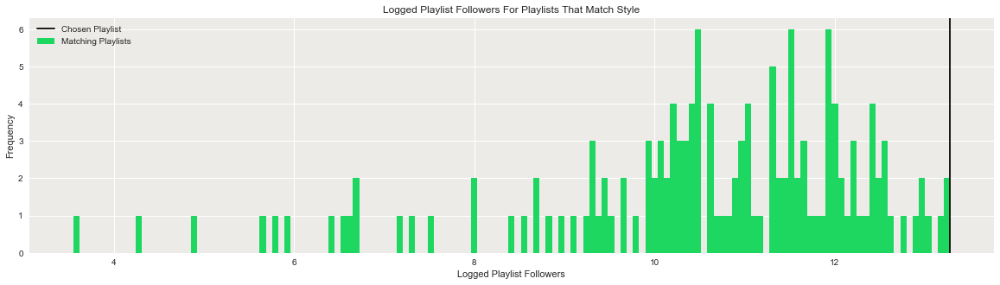
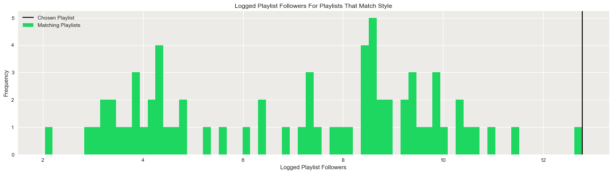

## Contents
{:.no_toc}
*  
{: toc}


## Generating Successful Playlists

### Methodology

One of the high-level project goals was to

> "use a regression based model to generate new playlists according to a user-specified genre or other search filter."

To this extent, the fitted Gradient Boosting Regressor has been used. Specifically, the process of generating a playlist based on user-specified genre or other criteria is:

1. Select a subframe of the data (from the master dataframe) based on the user-specified preference (e.g., genre, audio feature or artist)
2. Employ the fitted Gradient Boosting Regressor model to predict which playlist from the sub-dataframe would most likely have the most followers (using all predictors available)
3. From the predicted most popular playlist, sample a number of songs randomly (where the user can specify how many songs are desired)
4. Return the song selection and provide the possibility to plot additional metrics


### Examples

For example, if you feel like listening to deep house, simply type "deep house" and the number of songs for your custom playlist. The function will return that number of songs from the most highly rated (in terms of followers) predicted playlist in Spotify.


```python
optimized_playlist("deep house",10)
```


    ['Feel Good',
     'Static',
     'Coming Home',
     'Love & War (feat. Yade Lauren)',
     'Living',
     'Only One - Radio Edit',
     'Open',
     'Another Shot',
     'If I Lose Myself - Alesso vs OneRepublic',
     'Let Me Love You']


Similarly, to get a better understanding of all the "deep house" playlists in the data set, simply expand the function request as per the below. The output is a graph which shows the predicted logged followers of all playlists that match the genre "deep house". As is clear, the function samples songs from the most highly rated predicted playlist.


```python
optimized_playlist("deep house",10,summary=False,plot=True)
```





Other inputs work just as well - for example, assume you are in the mood for "2000s" songs. Simply request "Str_2000s" from the function and the number of songs requested and the output will be a sample of songs from the predicted most highly followed playlist containing "2000s" songs.


```python
optimized_playlist("Str_2000s",5)
```


    ['Dani California',
     'Mudshovel - Explicit Album Version',
     'Animal I Have Become',
     'Welcome Home',
     'In The End']


As per the above, to get a better understanding of "2000s" playlist popularity (and to understand from which playlist the songs get sampled), simply request for the plot to display.


```python
optimized_playlist("Str_2000s",5,summary=False,plot=True)
```





The example genres showcased above are only a small sample of choices that the playlist generator can deal with - in essence, all predictor columns of the data set could be used (albeit with slightly tweaked inputs) instead as well. Other examples include: "violin", "Str_Workout", "pop", "Rihanna" and hundreds more.

## Conclusion & Future Work

**Conclusion**

Spotify’s music recommendation engine is vital to the company for two primary reasons. First, Spotify's foremost revenue source is its paying customer base - being able to offer these customers good service in the form of relevant music is vital. Second, Spotify is incentivized to provide non-paying customers with relevant recommendations in the hope of converting those customers to paying ones instead. 

With this backdrop in mind, we set out to accomplish two main tasks:

1. Determine what variables and model could be used to predict the success of a Spotify playlist (i.e., its follower count) more accurately than relying on a simple baseline model.

2. Generate custom playlists, according to user-specified filters, which are deemed likely to be popular using the aforementioned fitted model.

A total of 9 baseline models were fitted on our training set and evaluated out-of-sample on the test set. Example models include variations of simple multiple linear regression including regularization and principal component analysis. A further 9 advanced models were trained and tested along similar procedures - advanced models include neural networks, random forests, boosted regression trees and support vector regressors among others. 

Out of the baseline models examined, out-of-sample performance in terms of r-squared was highest for multiple linear regression on a reduced set of dimensions using PCA with $R^2=0.13$ on the log-value of playlist follower count. The best performing model overall was the gradient boosted regressor with $R^2=0.36$ on the log-value of playlist follower count.

The most important features for the gradient boosted regressor were found to be (i) the audio features mean valence and mean danceability and (ii) the mean popularity of the artists in the playlists. Overall, these features are deemed intuitive a playlist's popularity.

Finally, the optimized gradient boosted regressor was also used to generate custom playlists according to user-specified filters. Overall, the songs put forward by the model are deemed a propos given the filters and overall decent suggestions are made.

**Future Work**

Potential additional insights and improved model accuracy could be gained in future work by expanding the feature space to include for example non-linearities and polynomial interaction terms. Also, the playlist generation feature could be further enhanced if songs were sampled from a broader range of playlists (and not just from the predicted most succesful playlist) through the use of advanced stochastic optimization algorithms.
