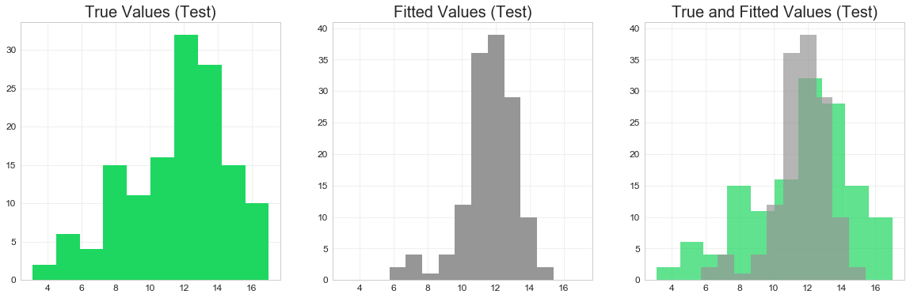

## Contents
{:.no_toc}
*  
{: toc}


## Source Code

Please refer to [Model Inference](https://github.com/toledy/spotify/blob/master/notebooks/inference.ipynb) for the source code (Jupyter Notebook).


## Predictor Importance

We choose Gradient Boosting Regression as the best model to predict playlist popularity. This model has high interpretablilty, enabling us to analyze the most important features and qualities of popular playlists. To evaluate the importance of predictors for the gradient boosting tree, we use scores determined by the usefulness of the certain predictor during the construction of trees. 

Breiman et al. (1984) proposed that the following formula can be used to find the importance of a predictor variable for one given tree. [1]


$$I_l^2(T) = \sum_{t=1}^{J-1} \hat{i_t}^2 I(v(t)=l)$$

For a tree $T$, the importance of variable $X_l$ is summed over $J-1$ nodes of the tree. $I(v(t)=l)$ indicates whether predictor $X_{v(t)}$ was used to split the node, $\hat{i_t}^2$ is the estimated improvement in squared error risk. Because the method used is an ensemble of trees, the total importance of predictors is given by the sum of this value over all (M) trees, given below.  

$$I_l^2 = \frac{1}{M} \sum_{m=1}^M I_l^2(T_m)$$

The predictors are evaluated in importance for each broad category (artist/genre/audio feature) of predictors considered. The top 50 were chosen out of the total 949 predictors. 


    GradientBoostingRegressor(alpha=0.99, criterion='friedman_mse', init=None,
                 learning_rate=0.03, loss='huber', max_depth=5,
                 max_features='auto', max_leaf_nodes=None,
                 min_impurity_split=1e-07, min_samples_leaf=1,
                 min_samples_split=2, min_weight_fraction_leaf=0.0,
                 n_estimators=200, presort='auto', random_state=None,
                 subsample=1.0, verbose=0, warm_start=False)


### Important Audio Features 

In general, the most important category of features was found to be the audio features. In fact, 24 out of the most important 50 were audio features. 


<div>
<style>
    .dataframe thead tr:only-child th {
        text-align: right;
    }

    .dataframe thead th {
        text-align: left;
    }

    .dataframe tbody tr th {
        vertical-align: top;
    }
</style>
<table border="1" class="dataframe">
  <thead>
    <tr style="text-align: right;">
      <th>Feature</th>
      <th>valence_mean</th>
      <th>dance_mean</th>
      <th>valence_std</th>
      <th>speech_std</th>
      <th>liveness_mean</th>
      <th>loudness_std</th>
      <th>speech_mean</th>
      <th>mode_mean</th>
      <th>acousticness_std</th>
      <th>followers_std</th>
      <th>tempo_std</th>
      <th>instrumentalness_std</th>
      <th>key_mean</th>
      <th>time_mean</th>
      <th>liveness_std</th>
      <th>loudness_mean</th>
      <th>dance_std</th>
      <th>tempo_mean</th>
      <th>energy_mean</th>
      <th>key_std</th>
      <th>acousticness_mean</th>
      <th>followers_mean</th>
      <th>energy_std</th>
      <th>instrumentalness_mean</th>
    </tr>
  </thead>
  <tbody>
    <tr>
      <th>Importance Percentage</th>
      <td>100.0</td>
      <td>92.459074</td>
      <td>77.060993</td>
      <td>56.463127</td>
      <td>53.478693</td>
      <td>47.417054</td>
      <td>43.054002</td>
      <td>40.359594</td>
      <td>38.34399</td>
      <td>38.3274</td>
      <td>37.664597</td>
      <td>35.477903</td>
      <td>30.910104</td>
      <td>30.734492</td>
      <td>28.425508</td>
      <td>28.27619</td>
      <td>27.195735</td>
      <td>26.276604</td>
      <td>23.364516</td>
      <td>21.360647</td>
      <td>20.730889</td>
      <td>20.210386</td>
      <td>19.774391</td>
      <td>11.737473</td>
    </tr>
  </tbody>
</table>
</div>


Interestingly, the mean valence is shown to be the most important predictor. The valence of a song is defined by the mood of the song--whether it is a happy song (high valence) or a sad/angry song (low valence). We observe that both visually and with multiregression, valence is negatively correlated to playlist followers. Both the mean and the standard deviation are highly significant predictors, indicating that not only do people want to hear sad and depressing songs, but they prefer playlists that are mostly composed of consistent sad and depressing songs!

The second most important predictor is the mean of danceability. Songs that are more danceable have greater tempo and  rhythm stability, beat strength, and overall regularity.

Another important predictor is the speech standard deviation and mean. We also observe in the multi-regression inference that there is a negative correlation between speech and playlist popularity. This indicates that followers consistently prefer songs with less speech. 

### Important Genre Features


<div>
<style>
    .dataframe thead tr:only-child th {
        text-align: right;
    }

    .dataframe thead th {
        text-align: left;
    }

    .dataframe tbody tr th {
        vertical-align: top;
    }
</style>
<table border="1" class="dataframe">
  <thead>
    <tr style="text-align: right;">
      <th></th>
      <th>Importance Percentage</th>
      <th>Num_tracks</th>
      <th>Mean_Follow</th>
      <th>Total_Follow</th>
      <th>Std_Follow</th>
    </tr>
    <tr>
      <th>Feature</th>
      <th></th>
      <th></th>
      <th></th>
      <th></th>
      <th></th>
    </tr>
  </thead>
  <tbody>
    <tr>
      <th>'hip house'</th>
      <td>14.837564</td>
      <td>35.0</td>
      <td>394870.0</td>
      <td>13820445.0</td>
      <td>8.255246e+05</td>
    </tr>
    <tr>
      <th>'dance-punk'</th>
      <td>14.232088</td>
      <td>384.0</td>
      <td>240562.0</td>
      <td>89970041.0</td>
      <td>4.815128e+05</td>
    </tr>
    <tr>
      <th>'hardcore hip hop'</th>
      <td>12.197885</td>
      <td>433.0</td>
      <td>287570.0</td>
      <td>121354445.0</td>
      <td>1.001567e+06</td>
    </tr>
    <tr>
      <th>'slow core'</th>
      <td>10.253461</td>
      <td>37.0</td>
      <td>393312.0</td>
      <td>14159226.0</td>
      <td>6.365066e+05</td>
    </tr>
    <tr>
      <th>'indie poptimism'</th>
      <td>9.682095</td>
      <td>771.0</td>
      <td>261538.0</td>
      <td>197199914.0</td>
      <td>8.365860e+05</td>
    </tr>
    <tr>
      <th>'movie tunes'</th>
      <td>9.477833</td>
      <td>203.0</td>
      <td>306781.0</td>
      <td>59822247.0</td>
      <td>6.800909e+05</td>
    </tr>
    <tr>
      <th>'escape room'</th>
      <td>8.226294</td>
      <td>521.0</td>
      <td>233039.0</td>
      <td>118616861.0</td>
      <td>5.229733e+05</td>
    </tr>
    <tr>
      <th>'compositional ambient'</th>
      <td>8.218600</td>
      <td>375.0</td>
      <td>272666.0</td>
      <td>100613579.0</td>
      <td>5.892620e+05</td>
    </tr>
    <tr>
      <th>'adult standards'</th>
      <td>8.161076</td>
      <td>476.0</td>
      <td>251238.0</td>
      <td>115569352.0</td>
      <td>6.626870e+05</td>
    </tr>
    <tr>
      <th>'brill building pop'</th>
      <td>7.742838</td>
      <td>72.0</td>
      <td>252205.0</td>
      <td>17654320.0</td>
      <td>6.561112e+05</td>
    </tr>
  </tbody>
</table>
</div>


We can see from the table that significant genres include compositional ambient, dance-punk, welsh rock, hardcore hip hop, hip house, adult standards, escape room, and slow core. 

These may not be the most common genres, in fact the number of tracks in each of these genres are all below 600. However, we do see that for all of these genres, the mean number of followers is significantly higher. The recently booming popularity of escape rooms is a possible cause of the popularity of escape room music. We notice that these genres, although not frequently featured in playlists, may have very loyal and consistent listeners.  

### Important Title Features


<iframe id="igraph" scrolling="no" style="border:none;" seamless="seamless" src="https://plot.ly/~tingnoble/31.embed" height="525px" width="100%"></iframe>


The most important titles include years in the 2000s. Titles with 1990s are also significant, although lesser in degree. It is reasonable that people search for recent songs more often. 

### Important Interaction Features


<iframe id="igraph" scrolling="no" style="border:none;" seamless="seamless" src="https://plot.ly/~tingnoble/33.embed" height="525px" width="100%"></iframe>


The most important interaction we see is how much liveness differs for songs in a track, for pop music. Liveness refers to whether the track is likely to be performed live. In general, we see that the more likely a track is recorded live, the less number of followers the track would have. This relationship is particularly critical for pop and dance music. 

We observe that acousticness is an important feature for several different genres: hip hop, house, acoustic, and r&b. 

Lastly, how much energy and key may differ for songs in rap playlists is also quite significant. 

### Important Artists 


```python
artist_followers_df = pd.read_csv('data/artist_level_EDA.csv')
```


<div>
<style>
    .dataframe thead tr:only-child th {
        text-align: right;
    }

    .dataframe thead th {
        text-align: left;
    }

    .dataframe tbody tr th {
        vertical-align: top;
    }
</style>
<table border="1" class="dataframe">
  <thead>
    <tr style="text-align: right;">
      <th></th>
      <th>Importance Percentage</th>
      <th>Mean Followers</th>
    </tr>
  </thead>
  <tbody>
    <tr>
      <th>Yo Gotti</th>
      <td>17.104839</td>
      <td>1.171835e+06</td>
    </tr>
    <tr>
      <th>Post Malone</th>
      <td>8.293600</td>
      <td>1.380026e+06</td>
    </tr>
  </tbody>
</table>
</div>


We observe that the most significant artists were Yo Gotti, Led Zeppelin, and Post Malone. They are all of artists of different genres: Yo Gotti is an American rapper, Led Zeppelin an English rock band, and Post Malone an American rapper/singer/songwriter/guitarist. They all have a large number of mean followers for playlists they are featured in. 


<div>
<style>
    .dataframe thead tr:only-child th {
        text-align: right;
    }

    .dataframe thead th {
        text-align: left;
    }

    .dataframe tbody tr th {
        vertical-align: top;
    }
</style>
<table border="1" class="dataframe">
  <thead>
    <tr style="text-align: right;">
      <th></th>
      <th>Feature</th>
      <th>Importance Percentage</th>
    </tr>
  </thead>
  <tbody>
    <tr>
      <th>0</th>
      <td>popularity_std</td>
      <td>71.277682</td>
    </tr>
    <tr>
      <th>1</th>
      <td>popularity_mean</td>
      <td>36.864343</td>
    </tr>
  </tbody>
</table>
</div>


Unsurprisingly, the popularity of the artist has a great significance on the popularity of the playlist. What is surprising is that the standard deviation of artist popularity songs has a greater significance than the mean of the popularity. This indicates that a playlist having consistent artist popularity will gain more followers. 

## Inference for Residuals


The residuals plot above shows the difference between the predicted fitted values and the actual values, $\hat{y}-y$. The plot shows a pattern that is similar to a diamond. We observe that they are very dense around 12 (in log scale). A possible cause of this pattern in the residuals plot is the distribution of the response (in log scale), which is slightly left skewed. This is shown below. Consequently, the residuals will be high around 12. We can also observe that the distribution of the fitted values is narrower than the true response. Overall, the residuals seem to show heteroskedasticity which may require further investigation in future works.





References:

[1] Hastie, T., Tibshirani, R., & Friedman, J. H. (2001). The elements of statistical learning: Data mining, inference, and prediction. New York: Springer.
